# Retail Store - Proyecto DevOps

Retail Store es una aplicación de e-commerce basada en microservicios. Permite explorar un catálogo de productos, gestionar un carrito de compras, realizar el checkout, consultar órdenes y administrar productos desde un panel interno.

El objetivo del proyecto fue llevar una aplicación originalmente ejecutable solo de forma local hacia una solución desplegable, automatizada, observable y segura, aplicando prácticas DevOps sobre containerización, CI/CD, infraestructura como código, testing, seguridad integrada y monitoreo.

## Contenido

- [Ejecución local](#ejecución-local)
- [Arquitectura de la aplicación](#arquitectura-de-la-aplicación)
- [Variables de entorno](#variables-de-entorno)
- [Planificación y seguimiento](#planificación-y-seguimiento)
- [Estrategia de Git](#estrategia-de-git)
- [CI/CD](#cicd)
- [Containerización](#containerización)
- [Testing y calidad](#testing-y-calidad)
- [Seguridad integrada](#seguridad-integrada)
- [Infraestructura como código](#infraestructura-como-código)
- [Observabilidad y serverless](#observabilidad-y-serverless)
- [Evidencias](#evidencias)
- [Decisiones técnicas](#decisiones-técnicas)
- [Lecciones aprendidas](#lecciones-aprendidas)
- [Uso de IA generativa](#uso-de-ia-generativa)

## Ejecución local

### Requisitos previos

- Docker 24+
- Docker Compose v2.20+
- Git

### Configuración inicial

Antes de levantar los servicios, crear el archivo `.env` a partir del ejemplo incluido en el repositorio:

```bash
cp .env.example .env
```

El archivo `.env.example` contiene las variables necesarias para la base de datos y el panel de administración:

```env
POSTGRES_PASSWORD=changeme
ADMIN_PASSWORD=changeme
ADMIN_JWT_SECRET=changeme-string-largo-y-seguro
```

Para un entorno real, estos valores deben reemplazarse por secretos seguros y no deben versionarse.

### Inicio rápido

```bash
docker compose up --build
```

| Servicio | URL |
|---|---|
| Tienda | http://localhost:8080 |
| Admin | http://localhost:8081 |

Credenciales del panel admin:

- Usuario: `admin`
- Contraseña: valor configurado en `ADMIN_PASSWORD`

### Comandos útiles

```bash
# Detener los servicios
docker compose down

# Detener y eliminar volúmenes
docker compose down -v

# Reconstruir un servicio específico
docker compose up --build <servicio>

# Ver logs de un servicio
docker compose logs -f <servicio>
```

## Arquitectura de la aplicación

La aplicación está compuesta por servicios independientes, empaquetados en contenedores y comunicados por HTTP dentro de la red interna. La UI actúa como punto de entrada para el usuario final y enruta tráfico hacia los microservicios. El panel admin accede a PostgreSQL para tareas administrativas.

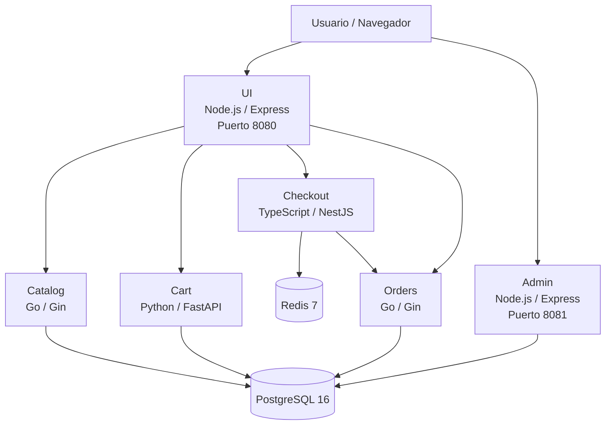

### Flujo de comunicación

| Origen | Destino | Protocolo | Descripción |
|---|---|---|---|
| UI | Catalog | HTTP REST | Listar y consultar productos |
| UI | Cart | HTTP REST | Agregar, quitar y consultar carrito |
| UI | Checkout | HTTP REST | Iniciar y confirmar checkout |
| UI | Orders | HTTP REST | Consultar historial de órdenes |
| Checkout | Orders | HTTP REST | Crear una orden al confirmar checkout |
| Checkout | Redis | TCP | Persistencia temporal del checkout |
| Catalog | PostgreSQL | TCP | Persistencia del catálogo |
| Cart | PostgreSQL | TCP | Persistencia del carrito |
| Orders | PostgreSQL | TCP | Persistencia de órdenes |
| Admin | PostgreSQL | TCP | Administración de productos y órdenes |

### Tecnologías por servicio

| Servicio | Lenguaje | Framework | Persistencia | Puerto externo |
|---|---|---|---|---|
| `ui` | TypeScript | Express | No aplica | 8080 |
| `catalog` | Go | Gin + GORM | PostgreSQL | Interno |
| `cart` | Python | FastAPI | PostgreSQL | Interno |
| `checkout` | TypeScript | NestJS | Redis | Interno |
| `orders` | Go | Gin + GORM | PostgreSQL | Interno |
| `admin` | TypeScript | Express | PostgreSQL | 8081 |
| `db` | - | PostgreSQL 16 | Volumen Docker | 5432 |
| `redis` | - | Redis 7 | Memoria | 6379 |

## Variables de entorno

### Ejecución local

| Variable | Uso | Ejemplo |
|---|---|---|
| `POSTGRES_PASSWORD` | Password del usuario PostgreSQL local | `changeme` |
| `ADMIN_PASSWORD` | Password del panel admin | `changeme` |
| `ADMIN_JWT_SECRET` | Secreto para firmar tokens JWT del admin | `changeme-string-largo-y-seguro` |

Estas variables se cargan desde `.env`, creado a partir de `.env.example`.

### Servicios de aplicación

| Servicio | Variables principales |
|---|---|
| `ui` | `RETAIL_UI_ENDPOINTS_CATALOG`, `RETAIL_UI_ENDPOINTS_CARTS`, `RETAIL_UI_ENDPOINTS_CHECKOUT`, `RETAIL_UI_ENDPOINTS_ORDERS` |
| `catalog` | `RETAIL_CATALOG_PERSISTENCE_PROVIDER`, `RETAIL_CATALOG_PERSISTENCE_ENDPOINT`, `RETAIL_CATALOG_PERSISTENCE_DB_NAME`, `RETAIL_CATALOG_PERSISTENCE_USER`, `RETAIL_CATALOG_PERSISTENCE_PASSWORD` |
| `cart` | `CART_PERSISTENCE_PROVIDER`, `CART_POSTGRES_HOST`, `CART_POSTGRES_PORT`, `CART_POSTGRES_DB`, `CART_POSTGRES_USER`, `CART_POSTGRES_PASSWORD` |
| `checkout` | `RETAIL_CHECKOUT_PERSISTENCE_PROVIDER`, `RETAIL_CHECKOUT_PERSISTENCE_REDIS_URL`, `RETAIL_CHECKOUT_ENDPOINTS_ORDERS` |
| `orders` | `RETAIL_ORDERS_PERSISTENCE_ENDPOINT`, `RETAIL_ORDERS_PERSISTENCE_USERNAME`, `RETAIL_ORDERS_PERSISTENCE_PASSWORD`, `RETAIL_ORDERS_PERSISTENCE_NAME` |
| `admin` | `DB_HOST`, `DB_PORT`, `DB_USER`, `DB_PASSWORD`, `ADMIN_USERNAME`, `ADMIN_PASSWORD`, `ADMIN_JWT_SECRET` |

### GitHub Actions

| Variable / secreto | Tipo | Uso |
|---|---|---|
| `AWS_ACCESS_KEY_ID` | Secret | Autenticación contra AWS |
| `AWS_SECRET_ACCESS_KEY` | Secret | Autenticación contra AWS |
| `AWS_SESSION_TOKEN` | Secret | Token temporal del laboratorio AWS |
| `TF_BACKEND_BUCKET` | Secret | Nombre del bucket S3 para estado remoto Terraform |
| `SEMGREP_APP_TOKEN` | Secret | Token opcional para Semgrep |
| `APP_URL` | Environment variable | URL base usada por k6 en el pipeline |

## Estructura del repositorio

```text
.
├── .github/workflows/
│   ├── app.yml                 # Pipeline de aplicación
│   └── infra.yml               # Pipeline de infraestructura
├── docs/
│   ├── branching-strategy.md   # Estrategia de ramificación
│   ├── evidencia/              # Capturas de ejecución y PRs
│   └── kanban/                 # Capturas del tablero Kanban
├── src/
│   ├── admin/
│   ├── cart/
│   ├── catalog/
│   ├── checkout/
│   ├── orders/
│   ├── postgres/
│   └── ui/
├── terraform/
│   ├── bootstrap/
│   ├── environments/
│   │   ├── dev/
│   │   ├── staging/
│   │   └── prod/
│   └── modules/
│       ├── ecr/
│       ├── ecs/
│       ├── ecs_service/
│       ├── networking/
│       └── observability/
├── tests/k6/
│   └── load-test.js
├── docker-compose.yml
├── .env.example
└── README.md
```

## Planificación y seguimiento

Se utilizó Kanban para planificar y hacer seguimiento del trabajo. El tablero incluyó tareas de aplicación, infraestructura, CI/CD, seguridad, testing, observabilidad y documentación.

<!-- TODO: reemplazar nombres/rutas si las capturas finales tienen otro nombre. -->

### Inicio del proyecto

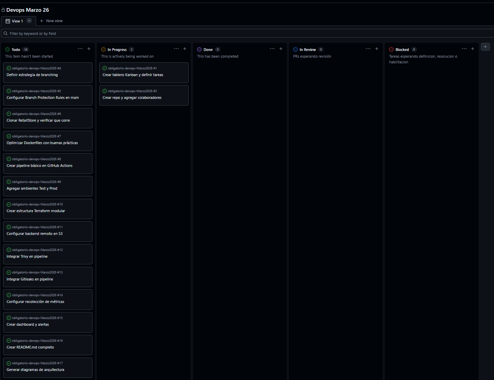

### Mitad del proyecto

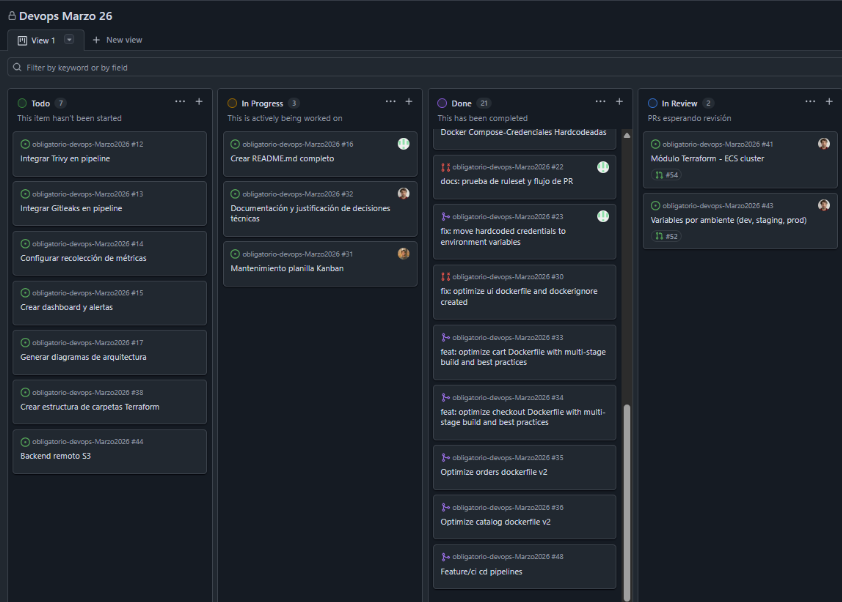

### Cierre del proyecto

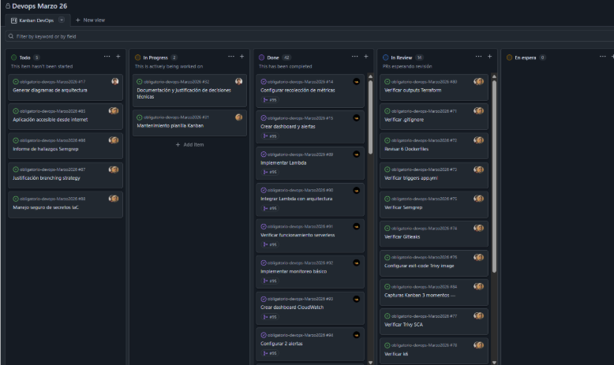

### Evolución del trabajo

Al inicio se identificaron las tareas principales: revisión del sistema existente, containerización, definición de pipelines, provisión de infraestructura, configuración de seguridad, pruebas, observabilidad y documentación.

Durante la mitad del proyecto el foco estuvo en implementar los workflows, crear módulos Terraform, ajustar imágenes Docker y validar el despliegue en AWS.

En el cierre se completaron evidencias, pruebas de carga, documentación, revisión de quality gates y ajustes finales para la entrega.

## Estrategia de Git

La estrategia adoptada fue GitHub Flow, por su simplicidad y adecuación a un equipo chico con entregas frecuentes. Cada cambio se desarrolla en una rama `feature/*`, se abre un Pull Request y se integra luego de revisión.

Aunque el modelo base es GitHub Flow, el repositorio utiliza ramas asociadas a ambientes para automatizar despliegues:

- `dev`: ambiente de desarrollo.
- `staging`: ambiente de test/staging.
- `main`: ambiente productivo.
- `feature/*`: ramas de trabajo.

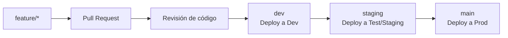

### Reglas de colaboración

- No se realizan pushes directos a `main`.
- Cada tarea se desarrolla en una rama propia.
- Los cambios entran mediante Pull Request.
- Cada PR debe ser revisado por al menos un integrante distinto al autor.
- Las ramas de feature se eliminan luego del merge.

La justificación completa se encuentra en `docs/branching-strategy.md`.

## CI/CD

El repositorio define dos workflows principales en GitHub Actions:

- `.github/workflows/app.yml`: construcción, análisis, publicación y despliegue de la aplicación.
- `.github/workflows/infra.yml`: validación, plan y aplicación de infraestructura Terraform.

### Ambientes

| Rama | Ambiente | Propósito |
|---|---|---|
| `dev` | Dev | Validación temprana de cambios |
| `staging` | Test/Staging | Validación previa a producción |
| `main` | Prod | Versión estable productiva |

### Pipeline de aplicación

El pipeline de aplicación se ejecuta ante cambios en `src/` sobre las ramas `dev`, `staging` o `main`, y también puede ejecutarse manualmente.

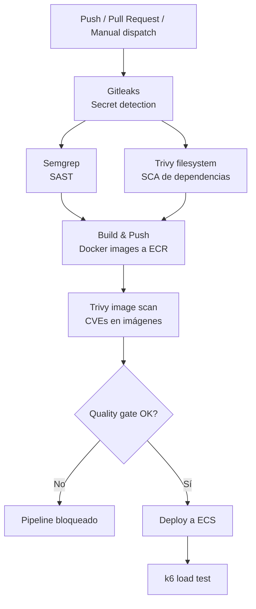

### Etapas del pipeline de aplicación

| Etapa | Herramienta | Objetivo |
|---|---|---|
| Secret scan | Gitleaks | Detectar secretos expuestos |
| SAST | Semgrep | Detectar patrones inseguros en código |
| SCA | Trivy filesystem | Analizar dependencias antes del build |
| Build | Docker | Construir imágenes por servicio |
| Registry | Amazon ECR | Publicar imágenes versionadas por SHA |
| Image scan | Trivy image | Analizar CVEs en imágenes construidas |
| Deploy | AWS ECS | Actualizar servicios en Fargate |
| Load test | k6 | Validar rendimiento básico post-deploy |

### Pipeline de infraestructura

El pipeline de infraestructura se ejecuta ante cambios en `terraform/` o manualmente. En Pull Requests ejecuta validación y plan; fuera de PR aplica los cambios.

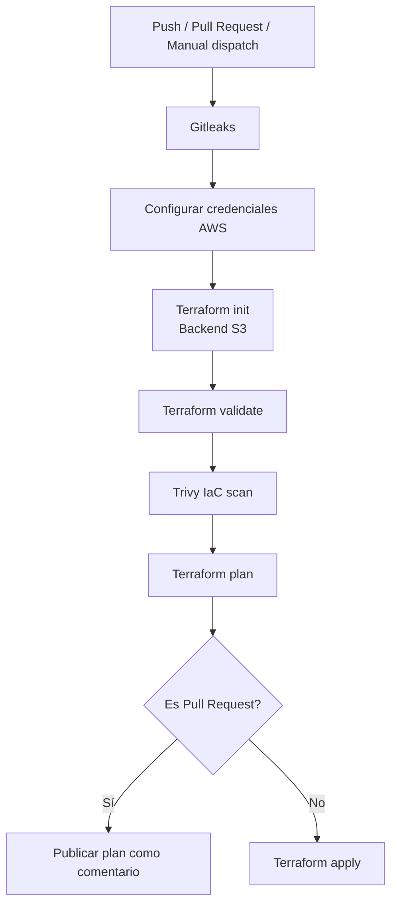

## Containerización

Cada microservicio cuenta con su propio `Dockerfile`, lo que permite construir y desplegar artefactos independientes.

Buenas prácticas aplicadas:

- Uso de imágenes base livianas como Alpine.
- Builds multi-stage en servicios Go, Node.js y Python.
- Instalación reproducible de dependencias (`npm ci`, `yarn install`, `go mod`, `requirements.txt`).
- Uso de usuarios no-root en los contenedores de aplicación.
- Archivos `.dockerignore` por servicio para reducir contexto de build.
- Separación entre servicios de aplicación y servicios de infraestructura local.

Las imágenes se publican en Amazon ECR con dos tags:

- `latest`
- SHA del commit (`github.sha`)

## Testing y calidad

Para cubrir el requerimiento de testing se eligió implementar una prueba de carga y rendimiento con k6. La herramienta resultó interesante para el equipo porque permite definir escenarios de carga, umbrales medibles y validaciones automáticas dentro del pipeline de CI/CD.

El objetivo de esta primera aproximación fue validar el comportamiento del catálogo bajo carga básica, observando dos aspectos principales:

- estabilidad de las requests;
- tiempo de respuesta del endpoint probado.

La prueba fue integrada al pipeline de aplicación y se ejecuta luego del despliegue. Si bien la implementación no quedó cerrada al 100% en esta iteración, la ejecución permitió obtener resultados útiles, identificar un problema de configuración en la ruta testeada y proponer mejoras concretas para fortalecer el quality gate.

### Configuración de k6

| Criterio | Umbral |
|---|---|
| Requests fallidas | `< 5%` |
| Percentil 95 de duración | `< 2000 ms` |

El endpoint base se configura mediante la variable `K6_BASE_URL`. En el pipeline se toma desde la variable de ambiente `APP_URL` configurada en GitHub Actions.

```bash
K6_BASE_URL=http://localhost:8080 k6 run tests/k6/load-test.js
```

### Informe de resultados

| Fecha | Ambiente | Resultado | Observaciones |
|---|---|---|---|
| 2026-06-28 | Pipeline CI/CD | Ejecución parcial | La prueba ejecutó 406 iteraciones, sin errores de red y con latencia dentro del umbral. Se detectó una inconsistencia en el check funcional de status HTTP 200. |

### Resultados observados

| Métrica | Resultado | Estado |
|---|---:|---|
| Iteraciones completadas | 406 | Informativo |
| Requests fallidas (`http_req_failed`) | 0.00% | Aprobado |
| Duración p95 (`http_req_duration`) | 0s | Aprobado |
| Check de tiempo menor a 2s | 100% | Aprobado |
| Check status HTTP 200 | 0% | No aprobado |
| Checks exitosos totales | 50% | No aprobado |

### Hallazgos y recomendaciones

La ejecución permitió validar que no hubo fallos de red y que la latencia se mantuvo por debajo del umbral definido. El resultado no fue completamente satisfactorio porque el check `catalog products: status 200` no pasó en ninguna iteración, pero este comportamiento permitió detectar una oportunidad de mejora concreta en la configuración de la prueba.

El análisis del código mostró que la UI expone los servicios internos bajo el prefijo `/api`. Por lo tanto, cuando `K6_BASE_URL` apunta a la UI, la ruta correcta para probar catálogo debería ser:

```text
/api/catalog/products
```

La prueba actual usa:

```text
/catalog/products
```

Esto explica que la ejecución pudiera completarse sin errores de red, pero sin cumplir el check funcional esperado.

También se detectó que los thresholds actuales solo validan tasa de errores HTTP y duración:

```js
thresholds: {
  http_req_failed: ['rate<0.05'],
  http_req_duration: ['p(95)<2000'],
}
```

Por ese motivo, el job puede quedar en estado exitoso aunque los checks funcionales fallen. Esta observación es relevante desde el punto de vista de calidad, porque muestra que no alcanza con medir latencia y tasa de error: también es necesario convertir los checks funcionales en parte del quality gate.

Como mejora, se debería agregar un threshold explícito sobre `checks`:

```js
thresholds: {
  http_req_failed: ['rate<0.05'],
  http_req_duration: ['p(95)<2000'],
  checks: ['rate>0.95'],
}
```

Recomendaciones:

- Corregir la ruta de k6 a `/api/catalog/products` cuando la prueba apunte a la UI.
- Agregar el threshold `checks: ['rate>0.95']` para que el pipeline falle si los checks funcionales no pasan.
- Re-ejecutar el pipeline y registrar la corrida final como evidencia.
- Ampliar las pruebas para cubrir catálogo, carrito, checkout y órdenes.
- Agregar pruebas funcionales o de integración entre microservicios como mejora futura.

Conclusión: la prueba de k6 quedó integrada y permitió ejercitar el pipeline con un escenario real de carga básica. Aunque el resultado final requiere una corrección adicional, el trabajo permitió identificar el ajuste necesario para que la prueba sea válida como quality gate en una siguiente iteración.

## Seguridad integrada

La seguridad se integra al ciclo de entrega mediante controles automáticos en el pipeline.

### Herramientas

| Herramienta | Tipo | Momento de ejecución | Propósito |
|---|---|---|---|
| Gitleaks | Secret detection | Primer paso del pipeline | Detectar credenciales expuestas |
| Semgrep | SAST | Antes del build | Analizar código fuente |
| Trivy filesystem | SCA | Antes del build | Analizar dependencias |
| Trivy image | Image scanning | Luego del build | Analizar imágenes Docker |
| Trivy config | IaC scanning | Pipeline Terraform | Analizar configuración Terraform |

### Quality gates

El pipeline bloquea la promoción cuando Trivy detecta vulnerabilidades `CRITICAL` o `HIGH` con fix disponible y no justificadas.

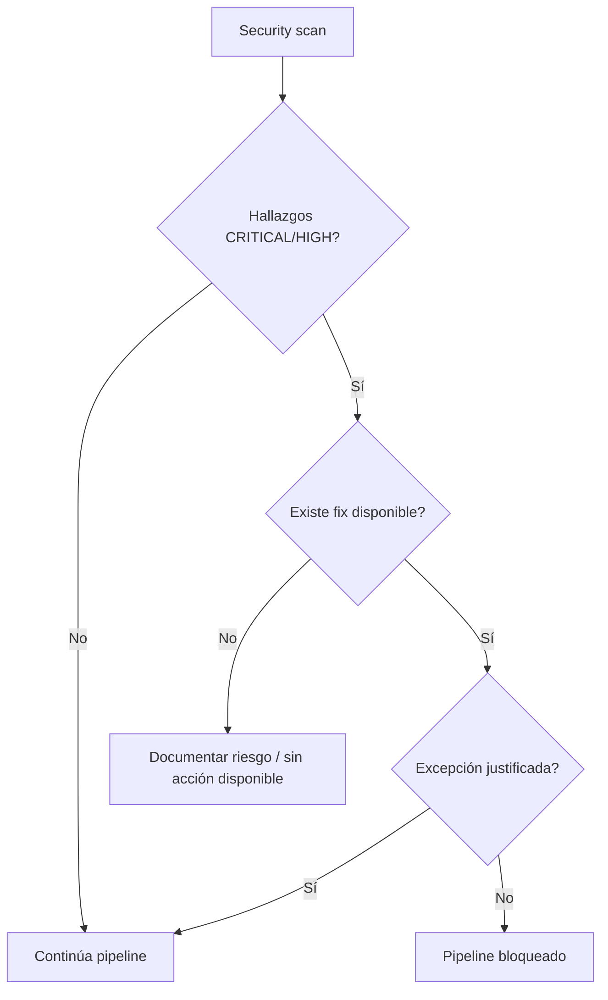

### Remediaciones y excepciones

<!-- TODO: validar si se mantiene .trivyignore. El workflow referencia .trivyignore, pero el archivo debe existir si se documentan excepciones. -->

| Hallazgo | Servicio | Acción |
|---|---|---|
| TODO | TODO | TODO |

### Manejo de secretos

En ejecución local, los secretos se cargan desde `.env`, archivo ignorado por Git. En GitHub Actions, las credenciales de AWS y tokens se obtienen desde GitHub Secrets.

<!-- TODO: revisar Terraform antes de entrega. Actualmente hay valores como retail_pass en archivos de ambiente. Para cumplir estrictamente el requisito de secretos, conviene parametrizarlos como variables sensibles o usar un mecanismo de secretos. -->

## Infraestructura como código

La infraestructura se define con Terraform y se organiza en módulos reutilizables. Cada ambiente cuenta con su propia carpeta y archivo `terraform.tfvars`.

### Módulos Terraform

| Módulo | Responsabilidad |
|---|---|
| `networking` | VPC, subnets públicas y privadas, Internet Gateway, NAT Gateways y route tables |
| `ecr` | Repositorios ECR por servicio |
| `ecs` | Cluster ECS Fargate |
| `ecs_service` | Task Definition, ECS Service, ALB y Target Group por microservicio |
| `observability` | CloudWatch Dashboard, alarmas, SNS y Lambda |

### Ambientes

| Ambiente | Carpeta | VPC CIDR | Rol |
|---|---|---|---|
| Dev | `terraform/environments/dev` | `10.0.0.0/16` | Desarrollo |
| Test/Staging | `terraform/environments/staging` | `10.1.0.0/16` | Validación |
| Prod | `terraform/environments/prod` | `10.2.0.0/16` | Producción |

### Backend remoto

El estado de Terraform se almacena en S3 y utiliza DynamoDB para bloqueo de estado.

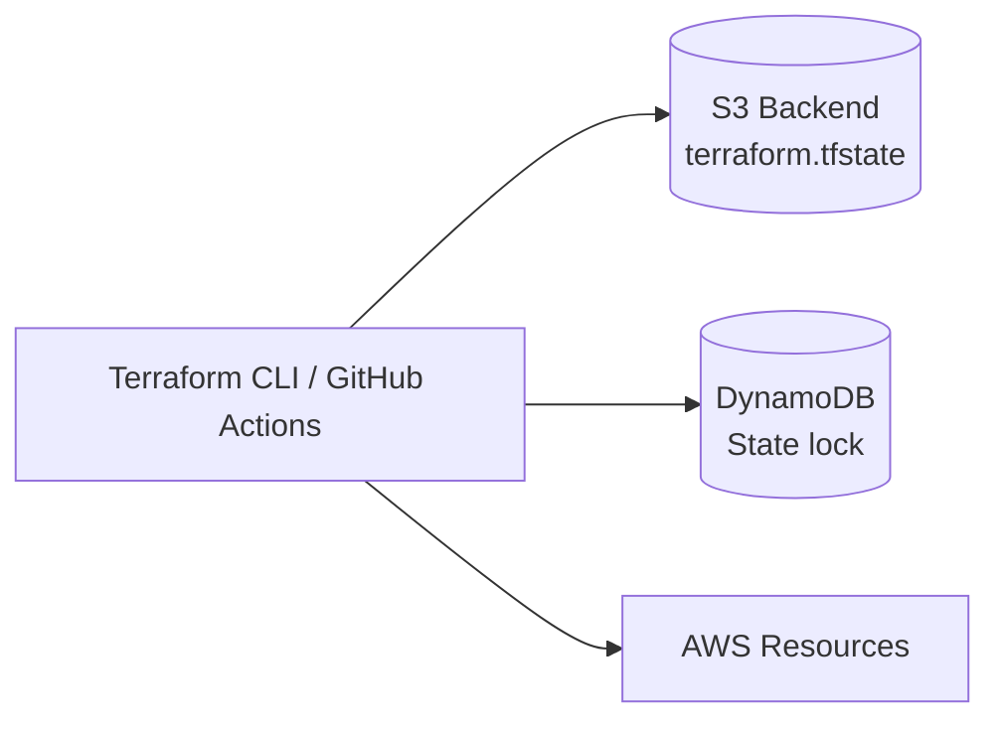

### Bootstrap

El directorio `terraform/bootstrap` crea los recursos necesarios para el estado remoto:

- Bucket S3 para `terraform.tfstate`.
- Tabla DynamoDB para locking.

```bash
cd terraform/bootstrap
terraform init
terraform apply
```

Luego, cada ambiente se inicializa indicando el bucket remoto:

```bash
cd terraform/environments/dev
terraform init -backend-config="bucket=<bucket-tfstate>"
terraform plan -var-file="terraform.tfvars"
terraform apply
```

## Observabilidad y serverless

La solución de observabilidad utiliza CloudWatch para métricas, logs, dashboard y alarmas. Además, se implementa una función Lambda integrada con SNS para procesar eventos de alarma, cumpliendo el requisito serverless con un propósito operativo claro.

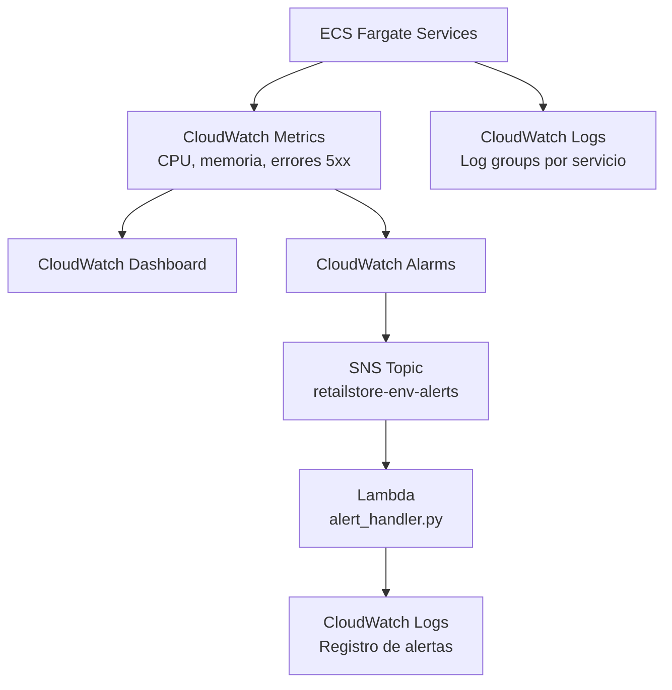

### Métricas y dashboard

El dashboard incluye:

- CPU por servicio ECS.
- Memoria por servicio ECS.
- Errores 5xx del ALB de checkout.
- Estado de alarmas.

### Alarmas

| Alarma | Métrica | Condición | Respuesta |
|---|---|---|---|
| CPU alta en checkout | `CPUUtilization` | Promedio > 70% durante 2 períodos de 5 minutos | Revisar dashboard, logs, tráfico y escalar si corresponde |
| Errores 5xx en checkout | `HTTPCode_Target_5XX_Count` | Suma > 5 en 5 minutos | Revisar tasks ECS, logs, imagen desplegada y dependencias |

### Logs centralizados

Todos los servicios envían logs a CloudWatch Logs mediante el driver `awslogs`.

| Servicio | Log Group |
|---|---|
| `ui` | `/ecs/ui` |
| `catalog` | `/ecs/catalog` |
| `cart` | `/ecs/cart` |
| `checkout` | `/ecs/checkout` |
| `orders` | `/ecs/orders` |
| `admin` | `/ecs/admin` |

Consulta sugerida en CloudWatch Logs Insights:

```sql
fields @timestamp, @message
| filter @message like /ERROR/
| sort @timestamp desc
| limit 50
```

### Servicio serverless

La función `alert_handler.py` recibe mensajes desde SNS cuando una alarma cambia de estado. La función registra el evento en CloudWatch Logs y permite centralizar el procesamiento de alertas sin mantener servidores permanentes.

## Evidencias

<!-- TODO: reemplazar rutas/nombres al agregar las imágenes finales. -->

### Pull Requests con revisión

La colaboración se evidencia mediante Pull Requests revisados por integrantes distintos al autor. Se documentan tres PRs, uno por cada integrante del equipo, aprobados por otro integrante.

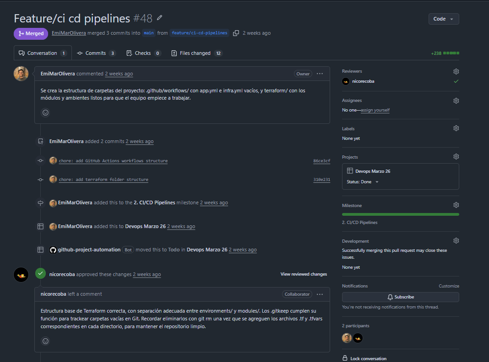

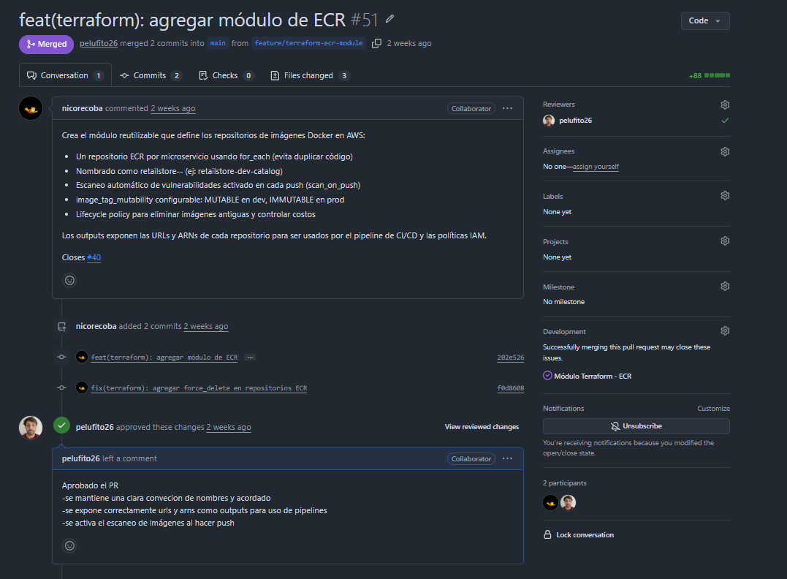

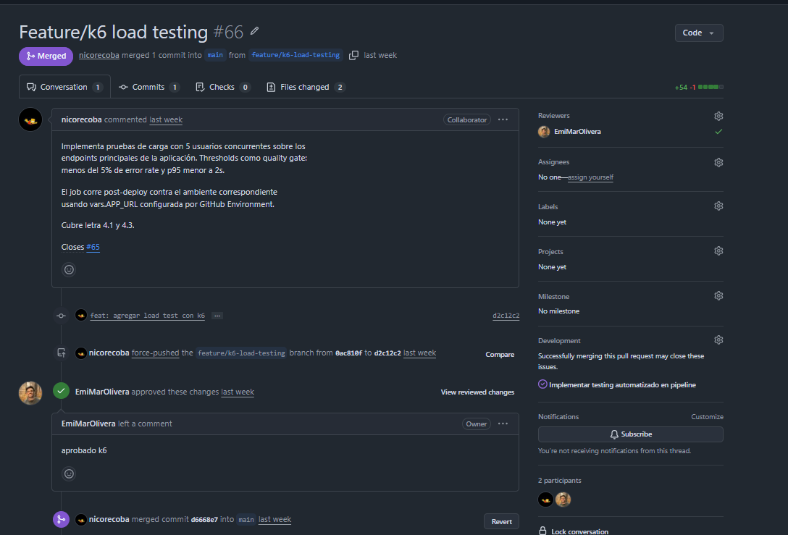

### Aplicación abierta

Vista de catálogo/tienda:

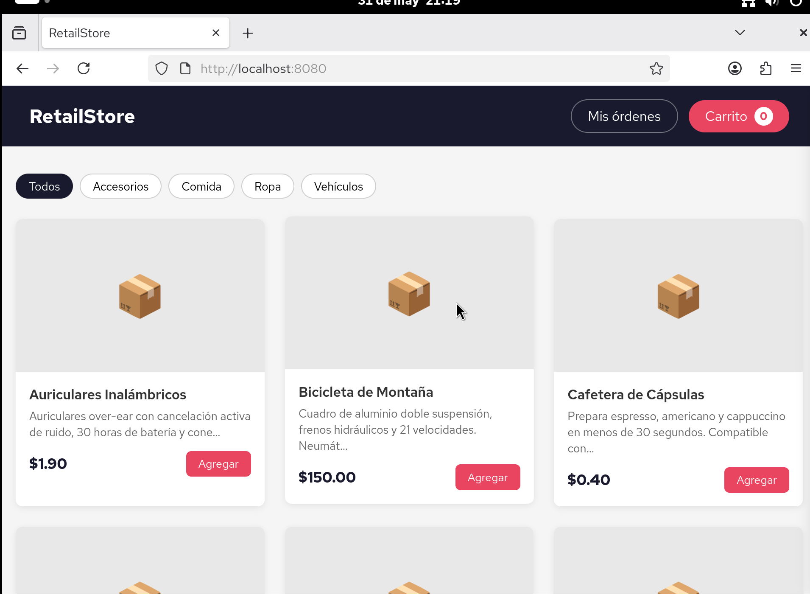

Vista del panel de administración:

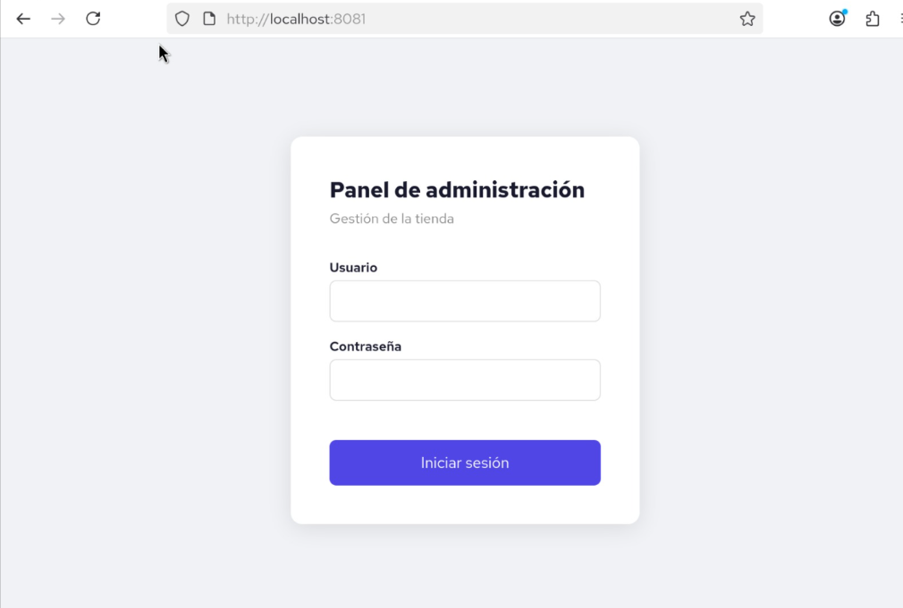

## Decisiones técnicas

### ADR 1 - Uso de AWS ECS Fargate

Se eligió ECS Fargate para ejecutar los contenedores porque permite desplegar microservicios sin administrar servidores EC2. Esto reduce carga operativa y se adapta al objetivo de entregar una plataforma mantenible para un cliente sin equipo propio de infraestructura.

### ADR 2 - Terraform modular

Se organizó Terraform en módulos reutilizables para separar responsabilidades: red, registry, cluster, servicios y observabilidad. Esto facilita reproducir ambientes y reduce duplicación entre Dev, Staging y Prod.

### ADR 3 - GitHub Actions como plataforma CI/CD

Se eligió GitHub Actions porque el código ya vive en GitHub y permite definir pipelines como YAML versionado junto al repositorio. Además, se integra con GitHub Secrets, Pull Requests y Code Scanning.

### ADR 4 - Trivy, Semgrep y Gitleaks para DevSecOps

Se integraron herramientas complementarias:

- Gitleaks para secretos.
- Semgrep para análisis estático.
- Trivy para dependencias, imágenes e IaC.

La combinación cubre distintas etapas del SDLC y permite aplicar gates automáticos antes del despliegue.

### ADR 5 - CloudWatch, SNS y Lambda para observabilidad

Se utilizó CloudWatch por su integración nativa con ECS y ALB. SNS y Lambda permiten reaccionar a alarmas sin mantener infraestructura adicional, cumpliendo además el requisito serverless.

## Lecciones aprendidas

- La separación por microservicios facilita despliegues independientes, pero exige documentar claramente variables, puertos y dependencias.
- Los quality gates deben definirse con criterios accionables; bloquear todo sin distinguir severidad o fix disponible puede frenar el flujo sin aportar valor.
- Terraform modular ayuda a mantener orden, pero el manejo de secretos debe diseñarse desde el inicio.
- Las evidencias son parte del entregable: capturas de tablero, Pull Requests y aplicación funcionando ayudan a demostrar el proceso, no solo el resultado técnico.
- La observabilidad debe pensarse como una herramienta operativa: las alarmas necesitan umbrales y procedimientos de respuesta, no solo configuración técnica.

## Uso de IA generativa

Durante el proyecto se utilizó IA generativa como herramienta de apoyo, principalmente para debugging, análisis de errores y exploración de posibles soluciones técnicas.

El uso se concentró en:

- interpretar errores de pipelines, Terraform, Docker y configuración de servicios;
- comparar alternativas de implementación para CI/CD, seguridad, observabilidad e infraestructura;
- revisar consistencia entre la consigna, la solución implementada y la documentación;
- mejorar la redacción técnica del README;
- proponer diagramas Mermaid y estructuras de documentación.

La IA no sustituyó la toma de decisiones del equipo. Las sugerencias generadas fueron revisadas, adaptadas y validadas por los integrantes antes de incorporarse al proyecto.
